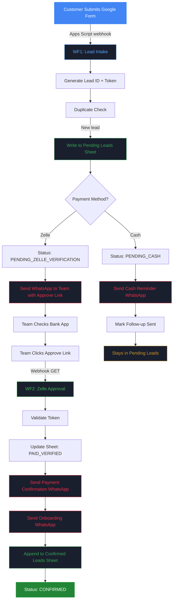

# Rangtal Garba — Registration System

Automated registration and payment tracking system for Rangtal Garba classes. Built with Google Forms, n8n Cloud, Google Sheets, and Twilio WhatsApp.

## What It Does

- Customers register via a Google Form
- Form data flows into n8n automatically via webhook
- Zelle payments get a one-click approval link sent to the team via WhatsApp
- Approved registrations trigger confirmation + onboarding messages to the customer
- Cash registrations get an automatic reminder
- Everything is tracked in a two-tab Google Spreadsheet

## Live Workflow Simulation

> **[Launch Interactive Simulation](https://nhp-atel.github.io/RangtalWorkflows/simulation/)** — Watch the full Zelle and Cash registration flows step-by-step in your browser.

## Architecture

### Zelle Payment Flow



## Status Model

| Status | Meaning |
|--------|---------|
| `NEW_LEAD` | Just submitted |
| `PENDING_ZELLE_VERIFICATION` | Awaiting Zelle approval |
| `PENDING_CASH` | Cash payment, reminder sent |
| `PAID_VERIFIED` | Zelle confirmed by team |
| `CONFIRMED` | Fully confirmed and onboarded |
| `MANUAL_REVIEW` | Needs human attention |

## Project Structure

```
docs/
  google-sheets-setup.md        # Column headers and sheet setup guide
  google-form-setup.md          # Form field configuration guide
  superpowers/
    specs/                      # Design spec
    plans/                      # Implementation plan
scripts/
  form-webhook.gs               # Google Apps Script (paste into Form)
templates/
  whatsapp-templates.md         # 4 WhatsApp templates for Meta approval
  approve-success.html          # Shown after successful Zelle approval
  approve-error.html            # Shown for invalid/expired approve link
  approve-already-done.html     # Shown if already approved
```

## n8n Workflows

Built directly in n8n Cloud:

| Workflow | Trigger | Purpose |
|----------|---------|---------|
| WF1 — Lead Intake | Webhook POST (from Google Form) | Generate Lead ID, write to sheet, branch by payment method, send notifications |
| WF2 — Zelle Approval | Webhook GET (approve link click) | Validate token, update sheet, send WhatsApp, append to Confirmed Leads |

## Setup

### Prerequisites

- Google account (Forms + Sheets)
- [n8n Cloud](https://n8n.io) account
- [Twilio](https://twilio.com) account with WhatsApp Business sender
- WhatsApp message templates approved by Meta

### Steps

1. **Google Sheets** — Create spreadsheet following `docs/google-sheets-setup.md`
2. **Google Form** — Create form following `docs/google-form-setup.md`
3. **n8n Credentials** — Connect Google Sheets OAuth2 + Twilio in n8n Cloud
4. **WhatsApp Templates** — Submit templates from `templates/whatsapp-templates.md` to Twilio/Meta
5. **Build WF1** — Lead Intake workflow in n8n (see implementation plan)
6. **Build WF2** — Zelle Approval workflow in n8n (see implementation plan)
7. **Apps Script** — Paste `scripts/form-webhook.gs` into Google Form Script Editor, update webhook URL
8. **Test** — Submit form, verify sheet, click approve link, check WhatsApp delivery

### Credentials Needed

| Credential | Source | Configured In |
|------------|--------|---------------|
| Google OAuth2 | Google Cloud Console | n8n Cloud |
| Twilio Account SID + Auth Token | Twilio Console | n8n Cloud |
| Twilio WhatsApp Sender Number | Twilio Console | n8n workflow nodes |

## Docs

- [Design Spec](docs/superpowers/specs/2026-04-15-garba-registration-system-design.md) — Full system architecture, data model, message templates
- [Implementation Plan](docs/superpowers/plans/2026-04-15-garba-registration-system.md) — Step-by-step build guide with n8n node configurations
