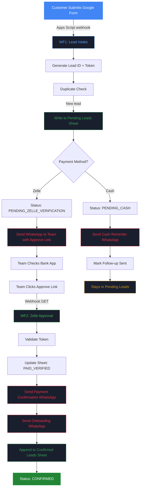

# Rangtal Garba — Registration System

Automated registration and payment tracking system for Rangtal Garba classes. Built with Google Forms, n8n Cloud, Google Sheets, and Twilio WhatsApp.

## What It Does

- Customers register via a Google Form
- Form data flows into n8n automatically via webhook
- Zelle payments get a one-click approval link sent to the team via WhatsApp
- Approved registrations trigger confirmation + onboarding messages to the customer
- Cash registrations get an automatic reminder
- Everything is tracked in a two-tab Google Spreadsheet

## Live Workflow Simulation

> **[Launch Interactive Simulation](https://nhp-atel.github.io/RangtalWorkflows/)** — Watch the full Zelle and Cash registration flows step-by-step in your browser.

## Architecture

### Zelle Payment Flow



## Status Model

| Status | Meaning |
|--------|---------|
| `NEW_LEAD` | Just submitted |
| `PENDING_ZELLE_VERIFICATION` | Awaiting Zelle approval |
| `PENDING_CASH` | Cash payment, reminder sent |
| `PAID_VERIFIED` | Zelle confirmed by team |
| `CONFIRMED` | Fully confirmed and onboarded |
| `MANUAL_REVIEW` | Needs human attention |

## Project Structure

```
docs/
  google-sheets-setup.md        # Column headers and sheet setup guide
  google-form-setup.md          # Form field configuration guide
  superpowers/
    specs/                      # Design spec
    plans/                      # Implementation plan
scripts/
  form-webhook.gs               # Google Apps Script (paste into Form)
templates/
  whatsapp-templates.md         # 4 WhatsApp templates for Meta approval
  approve-success.html          # Shown after successful Zelle approval
  approve-error.html            # Shown for invalid/expired approve link
  approve-already-done.html     # Shown if already approved
```

## n8n Workflows

Import the JSON files directly into n8n Cloud (... menu → Import from File):

| Workflow | File | Trigger | Purpose |
|----------|------|---------|---------|
| WF1 — Lead Intake | `workflows/wf1-lead-intake.json` | Webhook POST (from Google Form) | Generate Lead ID, write to sheet, branch by payment method, send notifications |
| WF2 — Zelle Approval | `workflows/wf2-zelle-approval.json` | Webhook GET (approve link click) | Validate token, update sheet, send WhatsApp, append to Confirmed Leads |

After importing, configure Google Sheets credential + Twilio credential on each node and select your spreadsheet.

## Connecting Google Form to n8n (Apps Script)

Google Forms doesn't have built-in webhook support. A small Apps Script bridges the form to n8n — it fires every time someone submits the form and sends the data to your n8n webhook.

### Setup

1. Open your **Google Form**
2. Click the **three-dot menu** (top right) → **Script Editor**
3. Delete the default code and paste:

```javascript
var N8N_WEBHOOK_URL = 'https://YOUR-INSTANCE.app.n8n.cloud/webhook/lead-intake';

function onFormSubmit(e) {
  var response = e.response;
  var items = response.getItemResponses();
  var data = {};

  items.forEach(function(item) {
    data[item.getItem().getTitle()] = item.getResponse();
  });

  UrlFetchApp.fetch(N8N_WEBHOOK_URL, {
    method: 'post',
    contentType: 'application/json',
    payload: JSON.stringify(data),
    muteHttpExceptions: true
  });
}
```

4. **Replace** `YOUR-INSTANCE` with your actual n8n webhook URL (find it by clicking the Webhook node in WF1)
5. **Save** (Ctrl+S)
6. Click the **clock icon** (Triggers) in the left sidebar → **+ Add Trigger**:
   - Function: `onFormSubmit`
   - Event source: `From form`
   - Event type: `On form submit`
7. Click **Save** and **Authorize** when prompted

### How It Works

```
Someone submits Google Form
  → Google automatically runs the Apps Script
    → Script collects all form answers as JSON
      → Sends POST request to your n8n webhook URL
        → WF1 picks it up and processes the registration
```

> The full script is also available at [`scripts/form-webhook.gs`](scripts/form-webhook.gs)

## Setup

### Prerequisites

- Google account (Forms + Sheets)
- [n8n Cloud](https://n8n.io) account
- [Twilio](https://twilio.com) account with WhatsApp Business sender
- WhatsApp message templates approved by Meta

### Steps

1. **Google Sheets** — Create spreadsheet following [`docs/google-sheets-setup.md`](docs/google-sheets-setup.md)
2. **Google Form** — Create form following [`docs/google-form-setup.md`](docs/google-form-setup.md)
3. **n8n Credentials** — Connect Google Sheets OAuth2 + Twilio in n8n Cloud
4. **WhatsApp Templates** — Submit templates from [`templates/whatsapp-templates.md`](templates/whatsapp-templates.md) to Twilio/Meta
5. **Import WF1** — Import `workflows/wf1-lead-intake.json` into n8n, configure credentials and spreadsheet
6. **Import WF2** — Import `workflows/wf2-zelle-approval.json` into n8n, configure credentials and spreadsheet
7. **Apps Script** — Follow the "Connecting Google Form to n8n" section above
8. **Activate** — Turn on both workflows in n8n
9. **Test** — Submit form, verify sheet, click approve link, check WhatsApp delivery

### Credentials Needed

| Credential | Source | Configured In |
|------------|--------|---------------|
| Google OAuth2 | Google Cloud Console | n8n Cloud |
| Twilio Account SID + Auth Token | Twilio Console | n8n Cloud |
| Twilio WhatsApp Sender Number | Twilio Console | n8n workflow nodes |

## Docs

- [Design Spec](docs/superpowers/specs/2026-04-15-garba-registration-system-design.md) — Full system architecture, data model, message templates
- [Implementation Plan](docs/superpowers/plans/2026-04-15-garba-registration-system.md) — Step-by-step build guide with n8n node configurations
